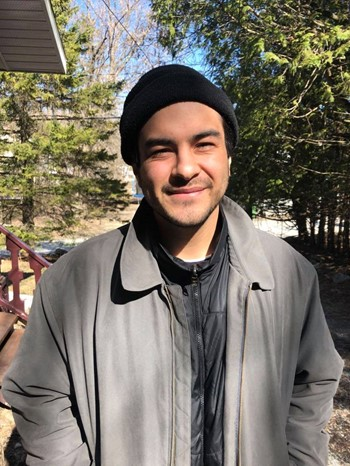
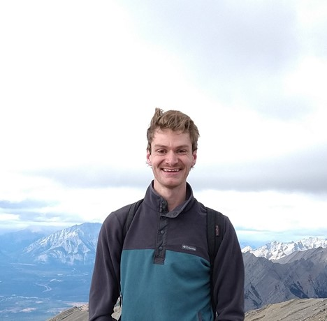

# ArcITECTS

## Team Member Bios

 **Olivier Makuch**: My name is Olivier Makuch and I am a geospatial enthusiast! During my Undergraduate in Environmental Science (BSc), I developed a particular interest in the intersection of Plant Ecology, Programming for Geospatial Technologies and Remote Sensing. I am now currently at COGS, in the Remote Sensing Graduate Certificate program, to pursue my understanding of this intersection and continue to learn about geospatial technologies and applications. I am excited to participate in the App Challenge 2022 for the opportunity to both learn more about Esri products, and further develop my collaborative skills in short term projects. 

 **Michael Hann**: My name is Mike/Michael Hann and I am passionate about applying remote sensing solutions to enhance industrial workflows. My main interests lie in agriculture, robotics, and resource management. 

I am participating in this challenge to:
1. use our combined expertise to provide a good, usable product
2. obtain more experience working within the wide Esri ecosystem
 

 **Becket Osterland**: Becket is a graduate student with a strong interest in studying the effects of climate change on the natural and human environments through mapping techniques. His passion runs deep for all things GIS and cartographic, and enjoys the scientific, computing, and artistic aspects that collide when making informative and visually stunning graphics. Beck graduated in 2020 from the Concordia Department of Geography, Planning and the Environment, with a BA in Human Environment and a minor in Geospatial Technologies. He is currently completing a Graduate Certificate in Remote Sensing at the Centre of Geographic Sciences in Lawrencetown, Nova Scotia. 
