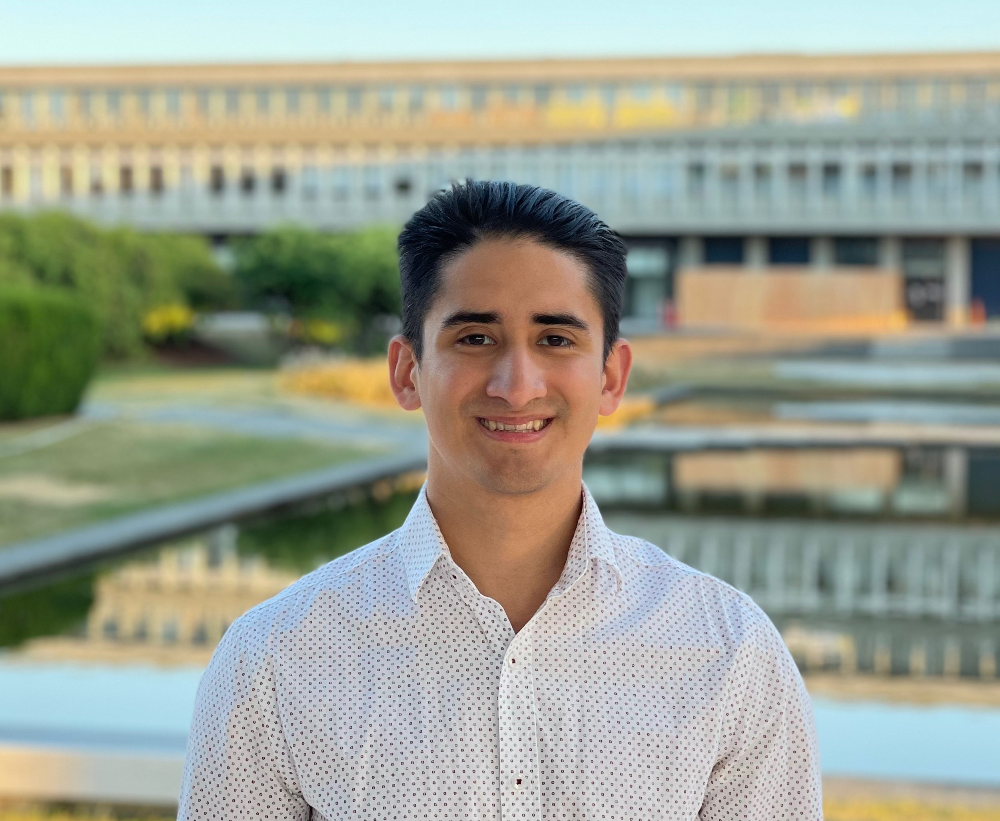

# BCITEAM

## Team Member Bios

 **Ferdinand Dorado**: Ferdinand graduated in 2019 with a Diploma of Computer Studies from Langara College. After taking an intro to GIS course in Langara he became interested to learn more about GIS and decided to continue his interest and pursue a degree in GIS. He is now studying at the British Columbia Institute of Technology in the Geographic Information Systems program. Some GIS projects he has done are finding vehicular related crime activity around the city of Vancouver, as well as, a project finding optimal locations for artillery to aid avalanche controls in Rogers Pass, BC during Op PALACI with the Canadian Armed Forces. He is excited to bring his GIS skills to any problem he encounters. 

 **Enrique Pedroso**: Residing in beautiful BC, Enrique is currently enrolled in the GIS Advanced Diploma program at British Columbia Institute of Technology (BCIT). As of 2021, he completed his undergrad at Simon Fraser University (SFU) where he had the opportunity of learning and leveraging GIS technologies in both academic and internship environments. In addition, Enrique is a passionate geographer that enjoys exploring and learning about the world through spatial data and GIS. Apart from academic and professional pursuits, Enrique enjoys collecting vintage maps, and spending his free time trail running or hiking BC beautiful west coast. 

 **Mitchell Bailey**: Mitchell is currently enrolled at the British Columbia Institute of Technology, pursuing an Advanced Diploma in Geographic Information Systems. He has a background in geology and GIS, having graduated from the University of Victoria with a BSc in Physical Geography & Earth and Ocean Sciences, and registered as a geoscientist-in-training with the province of British Columbia. He has gained experience working in diverse industries, from mining to agriculture, most recently as a GIS & LiDAR analyst for the utility sector. Recognizing the importance GIS plays in an increasingly data-driven society, Mitchell has developed an affinity for using data science to better understand the world around him. 