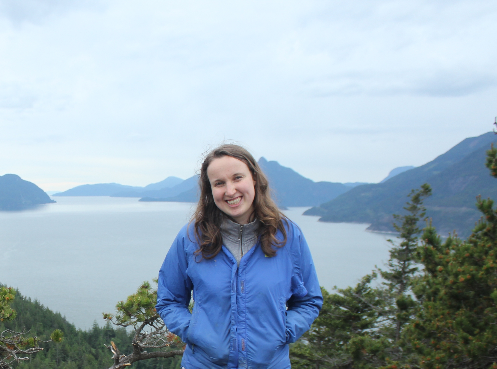

# Clever Cartographers

## Team Member Bios

 **Elysia Fuller-Thomson**, MSc Student: Elysia is a first-year masters student in Geography and Planning at the University of Toronto. She researches common air pollutants (nitrogen oxides, ozone, sulphur dioxide, and benzene) in a city of diverse pollutant sources, Hamilton, ON. In collaboration with the City of Hamilton and Environment Hamilton, Elysia implements field sampling, laboratory analysis, and land use regression modelling in order to gather ward-level and subpopulation specific observations to better understand which regions and what socioeconomic categories are most impacted by local air pollution exposure. In her free time, Elysia loves to explore the city and country around her by foot, bike, canoe, and much more! 

 **Amanda Norton**, PhD Student: My research is focused on methods measuring spatial health exposures. I hypothesize that individuals living in urban areas with increased socioeconomic disadvantage are at a higher risk of air pollutant (NOx and PM2.5) exposure and that these disparities can be more effectively modelled through improved exposure measurements at small spatial resolutions. To answer the question of disproportionate poor air quality exposure risk, I have two aims: 1) to define and identify socioeconomic disadvantage and 2) to define, measure, and model air pollutant exposure. As I develop measurement methods that best capture these two interacting health exposures, I will utilize novel modelling methods to reduce exposure measurement error. 

 **Scarlett Rakowska**, MSc Student: Scarlett Rakowska is a masters student interested in the microscale urban heat island (UHI) effect on active transportation. The objective of this research is to look at the UHI effect to investigate if we can predict heat exposure on active transportation using remote sensing techniques. Land Surface Temperature (LST) methods and meteorological data were collected in real-time using the Normalized Difference Vegetation Index (NDVI) in specific routes involving various surface materials and vegetation in the Greater Toronto Hamilton Area (GTHA). My research will contribute and improve planning in cities through remote sensing to help understand the relationship between exercise/activity and heat health effects on active transportation. 