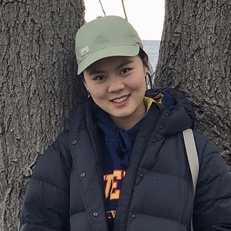
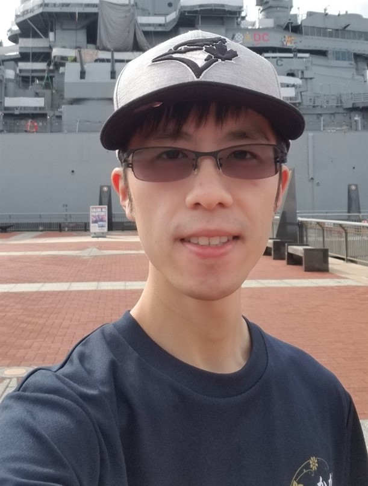

# Dumplings

## Team Member Bios

 **Jayden Zhe Chang**: Jayden is a first-year master’s student in the department of Geography and Environment at Western University. She specializes in Geographic Information System (GIS). Her research focuses on measuring the spatial accessibility to parks and recreation facilities in Canada. Outside of school she likes hiking, camping, and cooking. Her favorite dish is dumplings. 

 **Stanley Ho**: Stanley is a first-year master’s student in the department of Geography and Environment at Western University. He specializes in Geographic Information System (GIS). His research focuses on spatio-temporal analyses of public transit pass-ups in a mid-sized Canadian city. He is a huge baseball fan, an occational figure skater and a learner in Japanese language. In regard to the team name, he is also fond of all similar dishes like Wonton and Gyoza. 