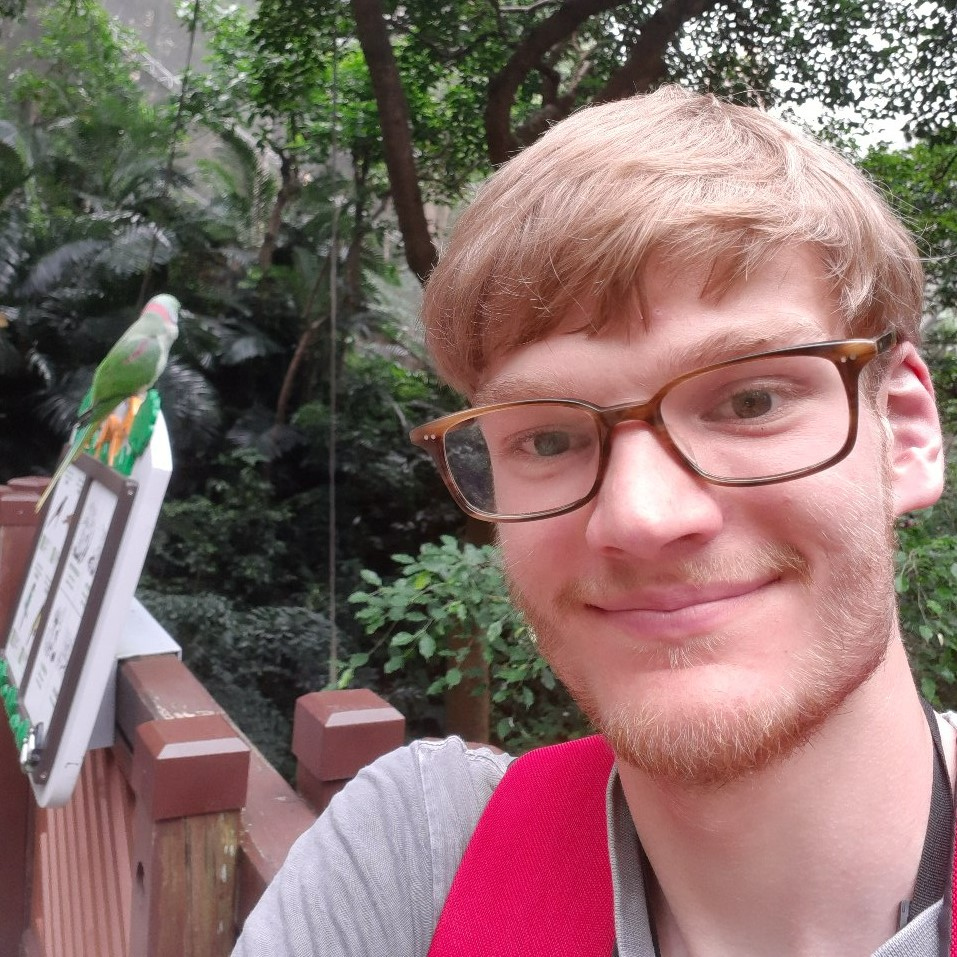
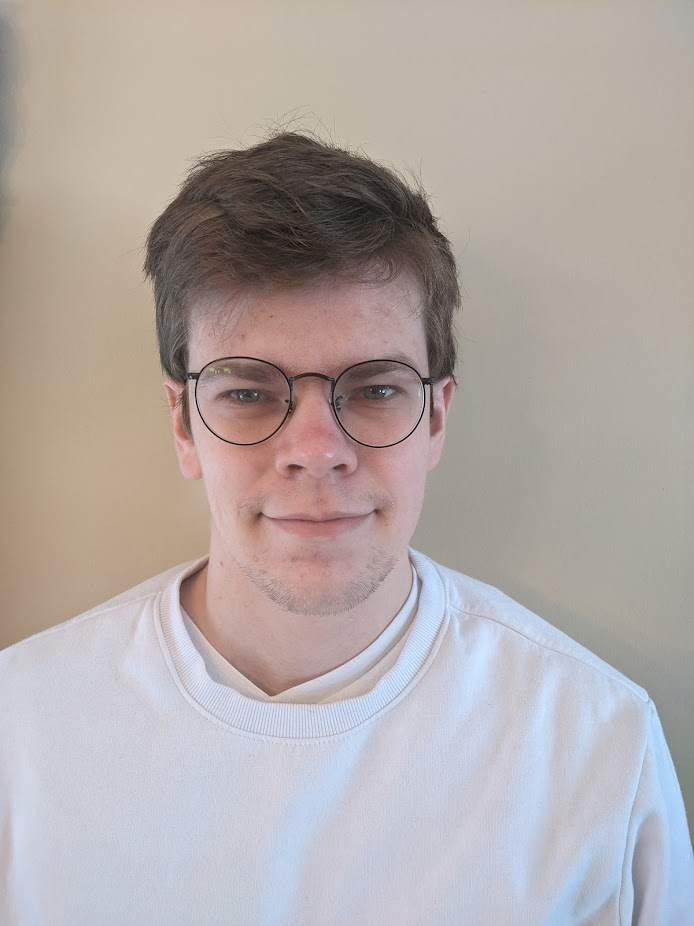
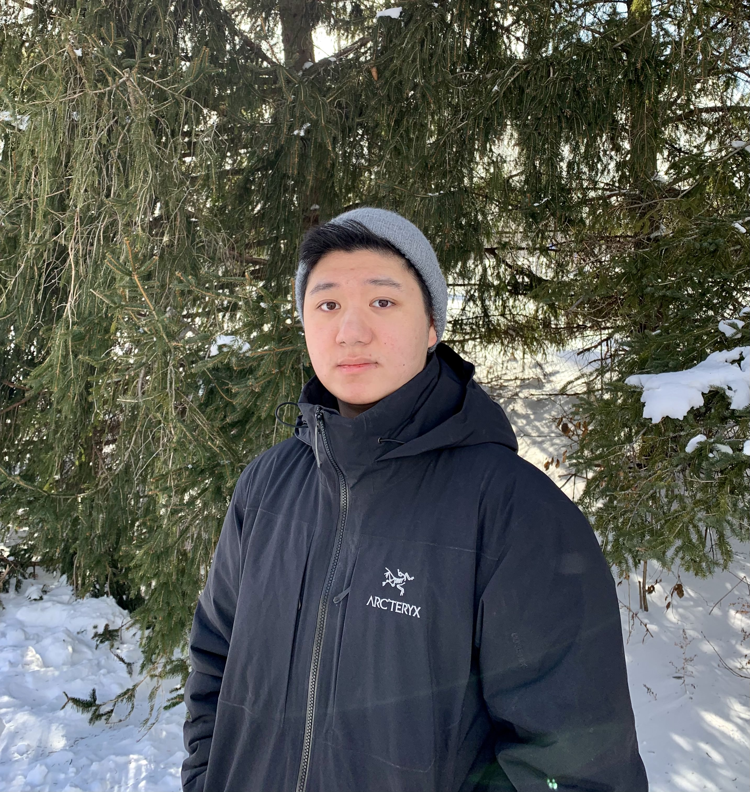

# G(oose)IS

## Team Member Bios

 **Ben Woodward**: I am a third year student at the University of Waterloo double-majoring in Geography and Earth Sciences. I am a former gold medalist at the International Geography Olympiad, placing third worldwide in 2019. My areas of interest include geography education and digital humanities, and I enjoy applying my web development and web GIS skills to both of these areas. Some of my projects include www.geoworkshops.ca, a free repository of geography-related workshops and resources for high school students and teachers, and www.bayfieldhistoricalwebmap.ca, a digital atlas that showcases historical photographs, postcards, and maps from Bayfield Ontario. 

 **Jason Sousa**: I am in my final semester at UW, majoring in geography and environmental management. I am interested in human interactions with the environment and how infrastructure development impacts ecological systems, particularly effects of development on our water resources. I have work experience in environmental assessment and post-construction monitoring, which initially seeded my interest in these areas. When I’m not looking at maps, I listen to a lot of music. 

 **Justin Lo**: I am a third year undergraduate student at the University of Waterloo majoring in Geomatics. My interests involve using GIS to address social issues prevalent in the global landscape and geography education. Some of my projects include developing a lookup application for the City of Waterloo and working on the COVID-19 animation project for the UW Geospatial Club. In my free time I enjoy rock-climbing, watching tv with my family, and spending time with my dog. 