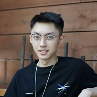
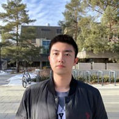

# GeoWellness

## Team Member Bios

 **Wenxuan Zhu (Vanessa)**: Vanessa is a first-year Master student in the Department of Geomatics Engineering at the University of Calgary. She received her BES in Geomatics at the University of Waterloo, where she worked on the pavement inspection using mobile laser scanning point clouds. Her current research interests are in geospatial data analysis and mapping linear features on modern geospatial reference frameworks. 

 **Qiyi Cai (Eric)**: Eric is a second-year Master student in the Department of Geomatics Engineering at the University of Calgary. He received his BES in Geomatics at the University of Waterloo. He is skilled in spatial data analysis and web application development with abundant experience throughout his academic years. His current interests in GIS include conducting innovative analysis in sustainability issues and developing interesting applications related to popular problems in the world. 

 **Yuankai Ning (Kai)**: Kai is a second-year Master student in the Department of Geomatics Engineering at the University of Calgary.  He received his BES in Geomatics at the University of Waterloo, where he conducted research on land use classification and related spatial analysis. With great interests in GIS-related studies and web map design, visualizing the feature patterns and analysis on GIS-related topics is his research field. 
