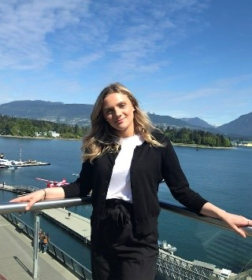

# London Conformal Conics

## Team Member Bios

 **Karlos Lao**: I'm in my 4th year of Honour Specialization in Geography and Commercial Aviation Management, this is my first time in the App Challenge, and I'm exciting to find out how me and my team can come together to solve a real-world issue!  My interest's area in GIS is related to remote sensing, LiDAR technology, and spatial analysis of urban climate heat patterns. In the near future, I'm hoping to explore the possibilities of incorporating GIS technology into aviation operations and flight planning. 

 **Caitlyn North**: I am currently in my last year at Western University studying Geography. This is my second year as a part of the ECCE team and second time participating in the app challenge. I love to use GIS to solve real world problems so this app challenge is right up my alley. I'm excited to see what all the teams come up with! 

 **Ben Klar**: I am a second year Master’s student at Western University in the Geospatial lab, and this is my third year as an ECCE associate. Most of my work looks at human mobility and transportation accessibility. In my spare time, I enjoy graphic designing, and running and biking outside. 
