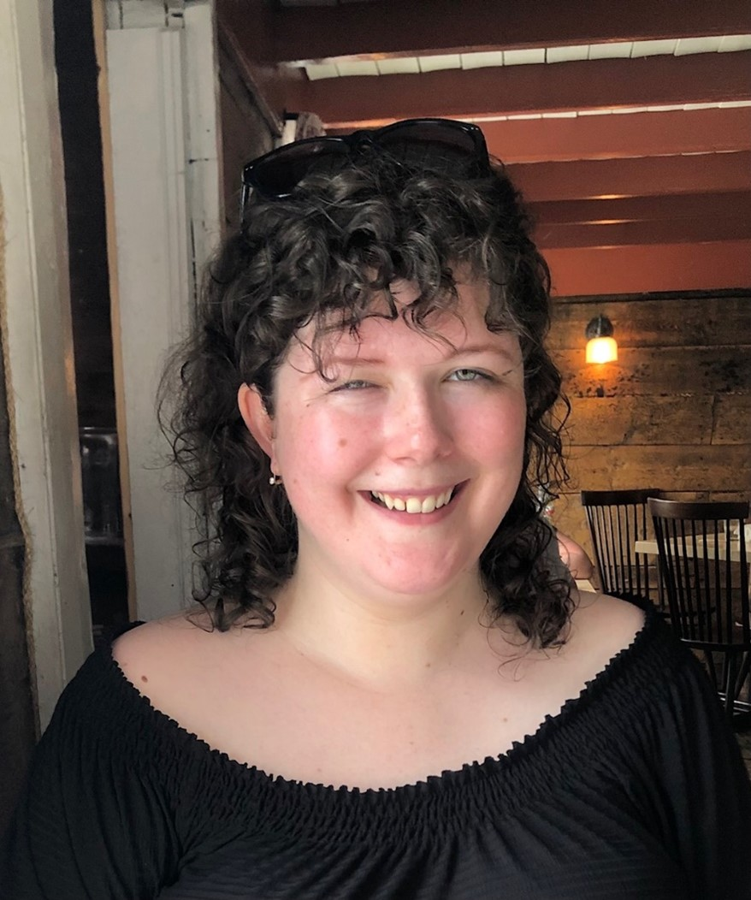
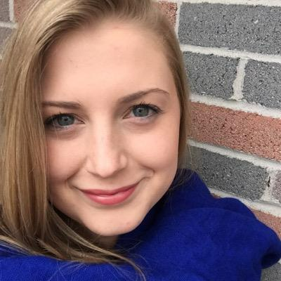
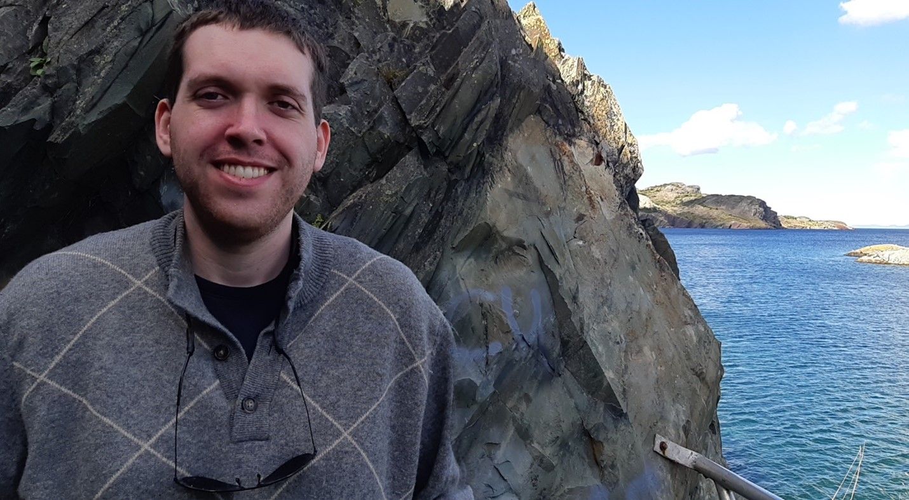

# Map n' Cheese

## Team Member Bios

 **Laura Sinclair**: Laura is currently a student in the one-year Advanced GIS Certificate Program at COGS. Her background is in geology, and she has a Masters in Geology from University College Dublin and a Bachelor in Earth Sciences from Memorial University. Her interests in GIS are related to geology, oceanography, and environmental sciences. She hopes to be able to incorporate some of her interest into this year’s challenge theme. Her hobbies include baking and swimming. 

 **Aila Jalo**: I am currently a student in the Remote Sensing program at the Centre of Geographic Sciences in Lawrencetown, Nova Scotia. I did my undergraduate degree in Geography at the University of Guelph, where I really enjoyed all the GIS courses. Outside of school I enjoy cooking, photography and watching the Toronto Raptors. 

 **Connor Dalzell**: Connor is an MSc. Applied Science Graduate with a background in Geology/Biology. Currently is enrolled in the Advanced GIS Certificate program at COGS. Areas of interest include Earth science, GIS/mapping, working with big data, and multivariate analysis. Excited to apply new GIS skills and previous experience to this technical/innovative challenge! 
