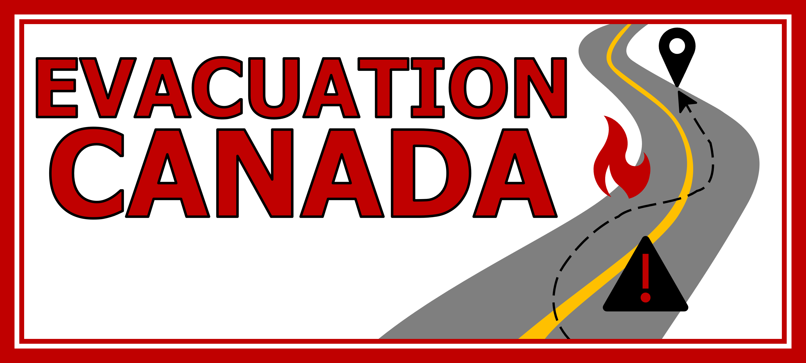
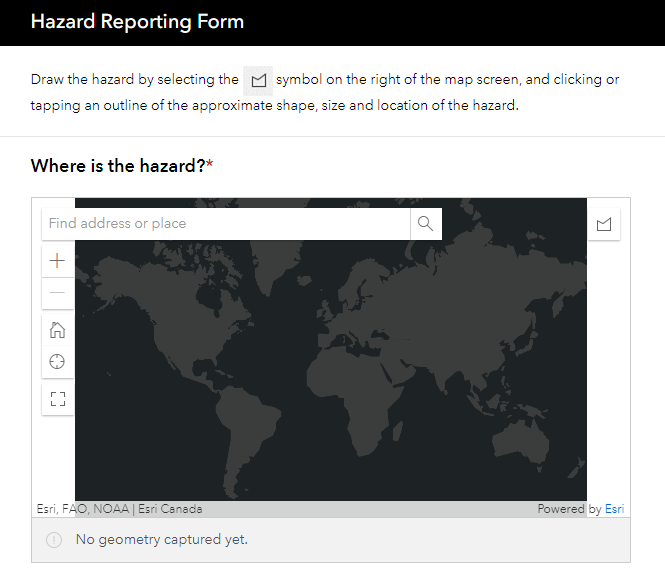
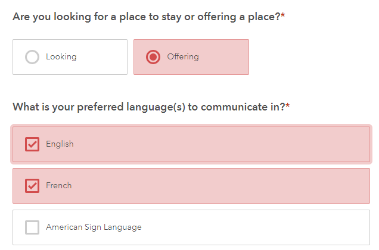

# Evacuation Canada
## _Building community when it matters most_
##### An App submitted for the 2022 Esri Canada ECCE App Challenge

### Our Mission:

Natural disaster prevalence has been on the rise in Canada in recent decades. From ice storms to wildfires or floods, disasters can disrupt lives, threaten safety, and cause tremendous anxiety. **They also can bring communities closer.** _Evacuation Canada_ is a one-stop hub designed for Canadians dealing with natural disasters. Our mission is threefold:

1. Help individuals navigate to safety, around various natural disasters and environmental hazards. We do this by combining the official sources Canadians know and trust, and by displaying crowd-sourced data from Canadians, for Canadians. These citizen-supported, open-source datasets help build resilient responses to natural disasters.
2. Respond to emergencies with unity and kindness is key to sustainable and resilient community-building. We connect those in need of emergency housing with those in their area that are able to provide shelter in hard times.
3. Provide easy access to important government resources, to inform those facing environmental hazards on government recommendations during the emergency.

### How we seek to fulfill our Mission:

_Evacuation Canada_ combines up-to-date government data on wildfires and floods, as well as crowd-sourced data on various environmental hazards to inform route decision-making for Canadians in emergencies. This has been identified as a key limitation of the Google Map platform -- it does not use disaster information to reroute vehicles around road segments that could potentially be hazardous. In times of emergency, everyone should be able to trust their routing software.
  Moreover, our hub offers a method of connecting individuals in need of emergency housing with those who can offer safe places to stay. In stressful times, no one should have to worry about having no place to go. _Evacuation Canada_ displays housing options and contact info geographically on a user-friendly web map.
  Finally, our app directs Canadians to further information on provincial emergency procedures and documentation. You, your family and your friends' safety is our highest priority. 
  _Evacuation Canada_ also has the privacy and best interests of Canadians in mind. Hazard areas created in the App can be edited and updated by any user, but entries in the housing portal can not be edited by anyone other than the individual/account who completed the form. 
  
### How to use the App:
  
#### Hub Homepage:
The Hub Homepage contains links to all relevant apps, maps and forms. It contains information about the app, as well as government directory items.

#### Find Safe Routes:
The Find Safe Route App has various functionalities that make it user-friendly, and extremely helpful for emergency navigation. Several layers of hazards are displayed, including fire hotspots, estimated fire burn areas (originally circles), user-reported hazards labelled by their hazard types, and government-reported flood locations. 
- **The Directions Widget** allows you to plan a route, while accounting for user-reported hazards and environmental disasters. It will plan a safe trip for you.
- **The "Near Me" tool** allows you to search for important resources (such as hospitals or fuel stations) within a desired radius of your location, or a location of your choice. It provides locations and addresses of many options, and can search up to a maximum radius of 15 km. 
- **The Share tool** allows you to share the app on various social media pages, to get the information out quickly in times of need. Media include Facebook, Twitter, Email and Google+.
- **The Hide Old Hazards widget** enables you to filter out user or government-reported hazards based on a date criteria of your choice; it ensures you do not have to see, or plan your route, around potentially out-of-date data.
- **The Smart Editor widget** gives you editing capabilities. Perhaps a fire perimeter, or a user-reported hazard perimeter is not quite accurate, or no longer exists. You have the ability to edit and contribute to the accuracy of the knowledge shared by Canadians in this app. 

#### Report Real-Time Hazards:
This page brings up the hazard reporting form, where you can draw the outline of the hazard locations on the survey map. From there, answer each of the questions, indicating the hazard types, any other notes that would be important for the public to know, and attach a photo to capture the extent of the environmental issue. When you submit the survey, the hazard you've reported now exists on the _Find Safe Routes App_ page, with all of the information you included!

#### Emergency Housing Portal:
The Emergency Housing Portal shows a map displaying locations of people looking for emergency housing and those offering housing. Below the map, there is a form where users can request or offer housing. The form asks a variety of important questions, such as: how many individuals are in need of housing, or how many individuals can be housed, whether the individual or home has pets, whether any accessibility accommodations are needed/offered, and more. Users give their contact information -- consenting to the potential of being contacted by other Hub users -- and submit their form. Their form response appears on the map, based on the location they input, and can be searched and filtered accordingly. Contact information is available in the pop-ups. For additional privacy, it is 1) recommended that users use their postal code (e.g. A1A 1A1) to set their point on the map, and 2) points are displayed as a heat map, rather than individual points. 

### Meeting the Sustainable Development Goals:

>> We need to promote innovative sustainable technologies and ensure equal and universal access to information
  
>> _GlobalGoals.org_

_Evacuation Canada_ seeks to contribute to the Sustainable Development Goal 11: "Sustainable Cities and Development". Two key components of Goal 11 focus on reducing the number of people adversely affected by natural disasters, and "adopting and implementing integrated policies and plans towards inclusion, resource efficiency, mitigation and adaptation to climate change, resilience to disasters...". 
_Evacuation Canada_ provides consistent access to up-to-date spatial information, and emphasizes the importance of crowdsourcing, as a community-based method of data collection. This allows for a larger number of observers to add hazards to the map, which can lead to better data coverage. Having easy access to software that uses a comprehensive dataset to ensure safety is crucial in times of emergencies, and improves the efficiency of disaster response. Furthermore, by reporting hazards, people can ensure others don't have to face the hazard they did. When people are working together to keep others nearby safe, they help form an inclusive and supportive community which is key during and after natural disasters. 

  Finally, from a humanitarian perspective, _Evacuation Canada_'s ability to connect individuals in need to those offering shelter furthers the **Right to Safe Housing**, and adheres to the SDG's emphasis on **protecting the most vulnerable and in need.** When community members who are able to help out others can easily do so, the resiliency of the community is strengthened. In addition, facilitating citizen to citizen connection reduces the stress on emergency response institutions, who may be overwhelmed during large natural disasters or as these events become more severe and frequent due to climate change. 
  
  **As our slogan suggests, we are building a community of neighbours coast to coast to coast, who stay informed, and help out in any way they can, when it matters most. Building sustainable and resilient communities starts at the individual level, and we are proud to provide a helping hand, to those Canadians who need it most.**

### Meet the Team:

- **Sherry Chen:** I am a second year Masters student studying the effects of changing water levels on the wetland water quality of coastal wetlands in the Great Lakes. 
I am also working on an atlas for the coastal wetlands in Georgian Bay. I enjoy cooking and going on hikes.

- **Emma Sherwood:** I am a second year Masters student at McMaster University. 
My research involves mapping peat smouldering vulnerability based on ecohydrological properties using machine learning. In my spare time, I play quidditch (a full contact, mixed gender sport) with a community team in Toronto.  

- **Daniel Van Veghel:** I am a first year Masters student in the School of Earth, Environment and Society's Transportation Research Lab. 
I am currently studying the effects of dedicated cycling infrastructure on inducing demand of bike share ridership in Hamilton. 
In my spare time, I am a member of McMaster's varsity curling team.  
