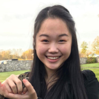
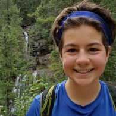
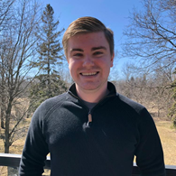

# McMaster Disaster Squad

## Team Member Bios

 **Sherry Chen**: I am a second year Masters student studying the effects of changing water levels on the wetland water quality of coastal wetlands in the Great Lakes. 
I am also working on an atlas for the coastal wetlands in Georgian Bay. I enjoy cooking and going on hikes. 

 **Emma Sherwood**: I am a second year Masters student at McMaster University. 
My research involves mapping peat smouldering vulnerability based on ecohydrological properties using machine learning. In my spare time, I play quidditch (a full contact, mixed gender sport) with a community team in Toronto. 

 **Daniel Van Veghel**: I am a first year Masters student in the School of Earth, Environment and Society's Transportation Research Lab. 
I am currently studying the effects of dedicated cycling infrastructure on inducing demand of bike share ridership in Hamilton. 
In my spare time, I am a member of McMaster's varsity curling team.  
