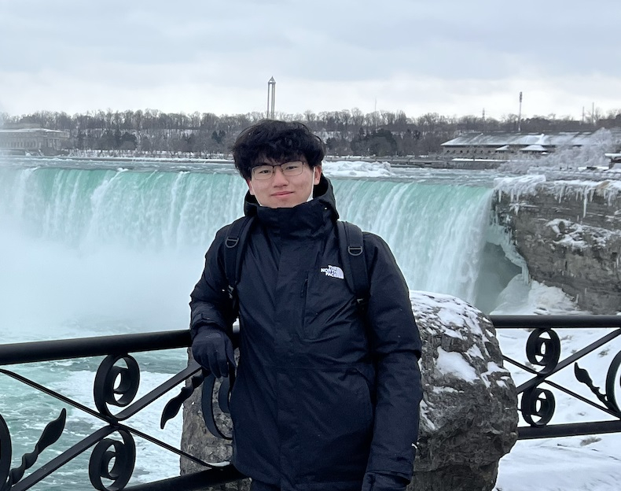
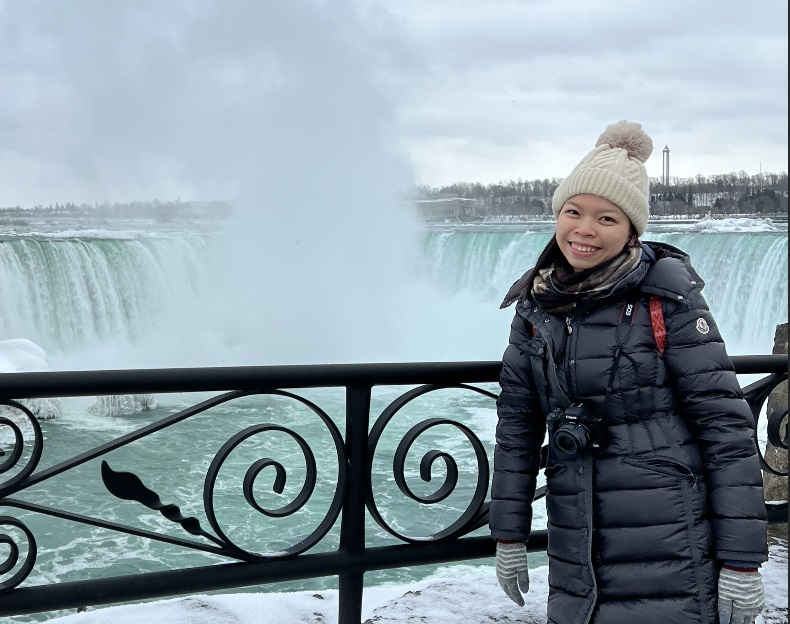

# MusCALar

## Team Member Bios

 **Chun Wai Wong (Kenny)**: Hi everyone! I am studying Master of Geographic Information Systems (MGIS) at the University of Calgary. I have worked in the field of soil science and environmental remediation as a research assistant in Hong Kong. This led me pursue GIS to support my future research and more complex analyses. My hobbies include playing badminton, hiking, and cooking. 

 **Hing Wa Ma (Henry)**: A 3rd year undergraduate with a major in geomatics engineering. Being an exchange student from the Hong Kong Polytechnic University. 

 **Lai Sze Cheung (Cherry)**: Hi my friends! I am studying Land Surveying and Geo-Informatics as a third-year student. GIS is fun and interesting so I would like to pursue my career to be GIS related. 
