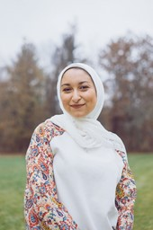

# Safer Space

## Team Member Bios

 **Sana Hashim**: Hi, my name is Sana Hashim and I am from Afghanistan. Currently, I am a 2nd year student majoring in Geographic Information Systems and minoring in Sustainability and Business & Entrepreneurship at the University of Toronto Mississauga. My hobbies include reading, playing sports, listening to music, and creating different forms of art. 

 **Lincoln Chung**: I’m Lincoln, currently a 4th-year student studying statistics and GIS. My interests include listening to music, watching youtube, and baseball. Excited to work on this challenge. 

 **Marim Abdel Kader**: Hi, My name is Marim and I'm currently a 4th-year student studying Geographical Information Systems with a double minor in Environmental Science and Sustainability. My hobbies include reading, painting, and playing video games when I'm free! I like to understand current social media marketing trends and how they affect people globally. I’m deeply interested in understanding the root of current injustice policies that are happening around the world. I believe knowing our history can help us navigate through a safer future and environment for everyone. 