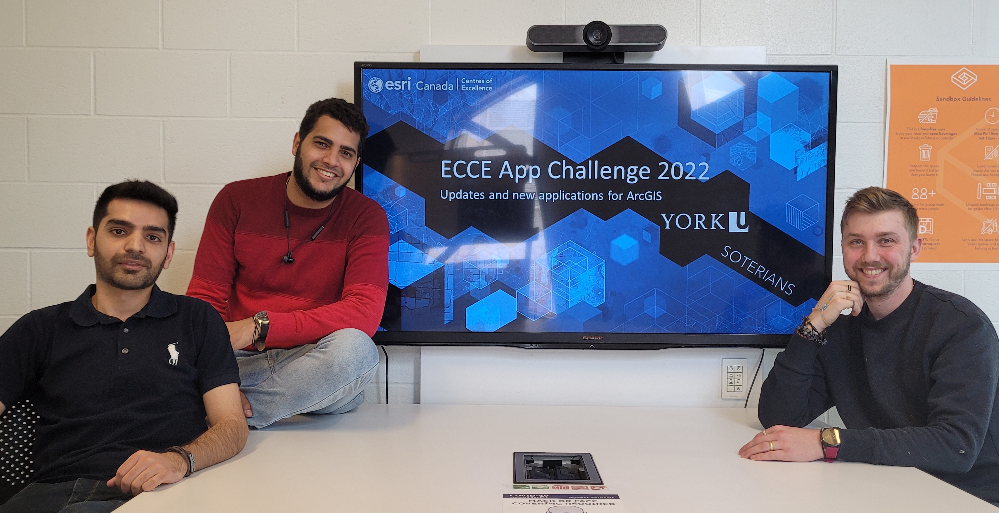

# Soterians

## Team Member Bios

**Amirhossein Nourbakhshrezaei**: Amir starts his Ph.D. program in January 2020 at the Geomatics Engineering Program, Lassonde School of Engineering, York University. He got his M.Sc. in the field of Geospatial Information System (GIS) Engineering from the University of Tehran. His passion is to bridge the gap between industry and academia in transportation systems design and development. His research domain includes geospatial data analytics, Location-Based Service(LBS) development, Quantum computing, and Graph Neural Networks (GNN). Currently, he is working on geospatial problems that can be solved as a discrete model, and he tries to solve algorithms with high computational complexity on quantum annealing computers. He is always ready to face challenges with a problem-solving manner.

**Artem Solovey**: Artem finished his software engineering degree at York in 2019 and started his company YuRide. He's looking to solve the issue of commuting to campus for students who drive and take public transit by matching them together and allowing them to share costs. His work at YuRide led to his current master's degree in Civil Engineering where he is researching ridesharing in combination with package delivery. Artem is also an Entrepreneur in Residence at the BEST Lab and the President of the ITE club at York. He's greatly involved in many initiatives on campus and in entrepreneurial communities at York and Schulich.

**Adonai García**: Adonai is a 1st year master student of Civil Engineering at York University. He's got a master's degree on smart mobility and another one on drones’ applications in engineering in Spain. He's working on electric cargo bikes in urban settings as part of his research. He has industry experience in sustainable mobility and road safety.  Currently, he's the transportation engineer at YURide, a ridesharing app for the York University. He's also the Chief Councillor of Lassonde School of Engineering at YUGSA (York University Graduate Students Association). He's involved in other initiatives on campus like ITE York U (Institute of Transportation Engineers), CEGSA (Civil Engineering Graduate Students Association), BEST Lab and others.
