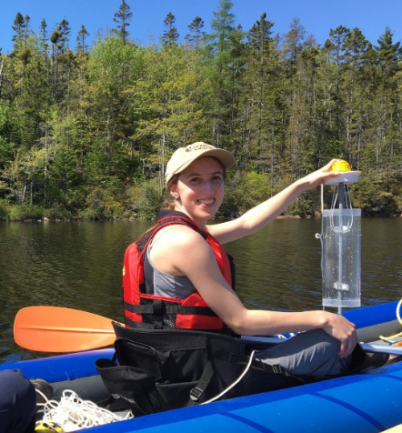
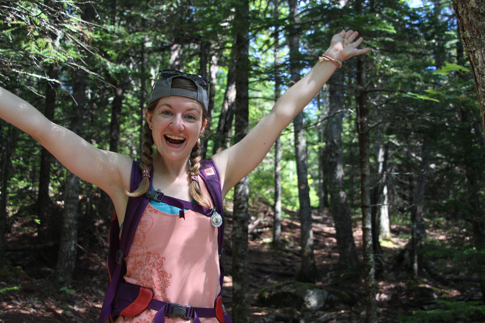
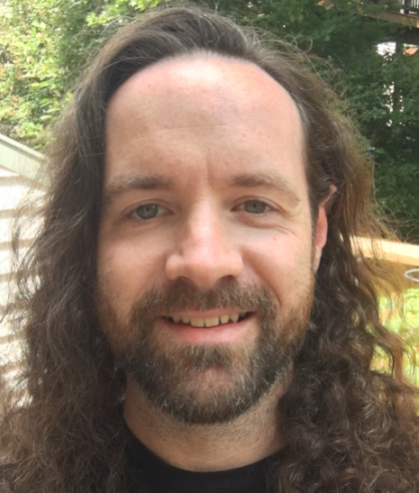

# Spatial Cluster

## Team Member Bios

 **Casey Doucet**: I am a second-year master’s student in the Applied Science in Environmental Engineering program at Dalhousie University. My research aims to identify factors that may be contributing to water quality changes in Halifax-area lakes. I also belong to the Aquatic Systems Professional and Industrial training for the Restoration Economy (ASPIRE) program at Dalhousie. Prior to my graduate studies, I completed my BSc with Honours in Environmental Science at Mount Allison University, where I also worked as a research technician in the Environmental Change and Aquatic Biomonitoring (ECAB) Lab and contributed to microfiber and microplastic research. 

 **Caitlin Cunningham**: I am in the Interdisciplinary PhD program at Dalhousie University who studies how cities could be better designed to support wildlife and meet biodiversity conservation goals. Originally, I was introduced to GIS because someone was offering free pizza as a part of a one day crash course. Over 10 years later, I'm still hooked, using GIS in both educational and professional settings, though I still won't say no to free pizza. 

 **Nicolas Beauchamp**: I am in my 5th year at Dalhousie University studying both Earth Science and ESS (Environment, Sustainability, and Society). My current academic goals include completing my undergraduate degree with Dalhousie’s certificate in GIS, and am planning out my route towards a Masters. When not studying, I am on nature walks or browsing through local record shops. 
