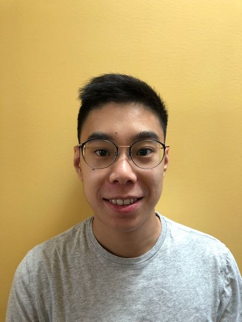
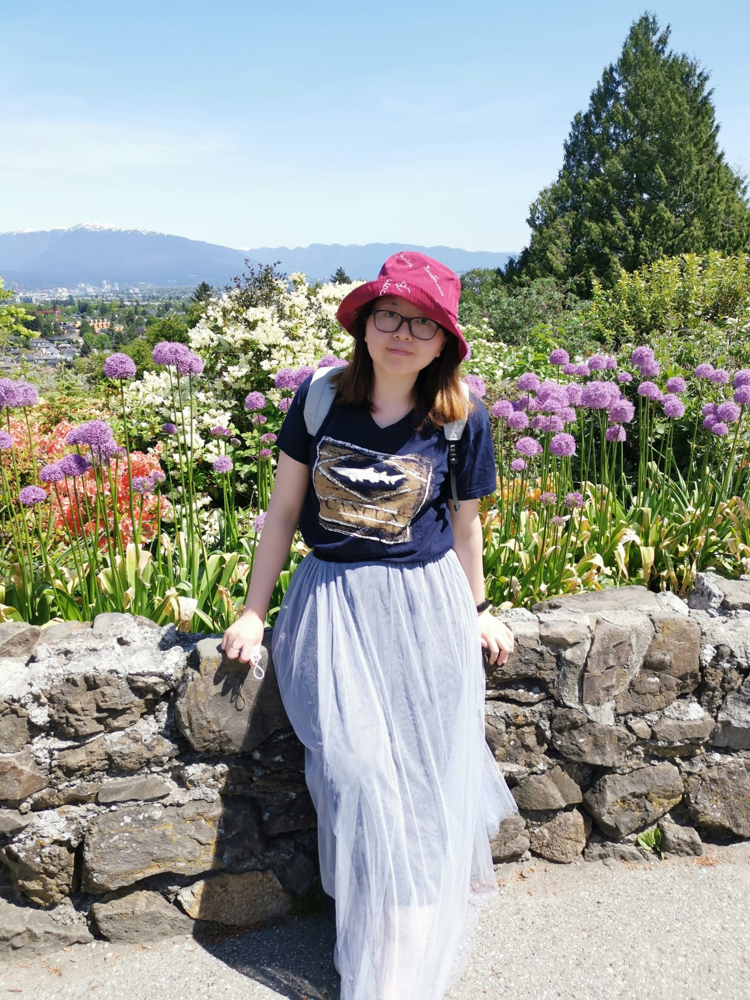

# Team Fire Legend

## Team Member Bios

 **Jason Lee**: Jason graduated from the University of British Columbia with a B.A in Geography Environment and Sustainability and a Minor in Economics in 2020. At UBC, he explored a wide variety of GIS, Remote Sensing and sustainability courses which led to his interest in the GIS sector. Jason has joined the BCIT GIS Program in order to develop his technical skills and hopes to be able to work in the GIS field with databases, urban and environmental analysis in the future. 

 **Sapphire Liu**: Sapphire graduated from Dalhousie University with a Master of Resource and Environmental Management Degree in 2014. She also spent two years in North Carolina to complete a Bachelor of Environmental Science Degree. She became interested in GIS after printed out her first giant map of North Carolina in the Cartography class. She worked in Bedford Institute of Oceanography for six months and used her GIS skills to monitor green crabs (invasive species) in Nova Scotia. Currently, she is enrolled in the Advanced Diploma program in Geographic Information Systems at BCIT to gain more professional GIS skills. After completing this program, she looks forward to exploring the GIS industry. During her spare time, she likes crafting, baking and hiking. 

 **Jillian Fung**: Jillian is a student at BCIT in the Bachelor of Technology program in GIS. Jillian hopes to combine her passion for the environment and her GIS skills in natural resource management, with a particular interest in the forestry industry. 
