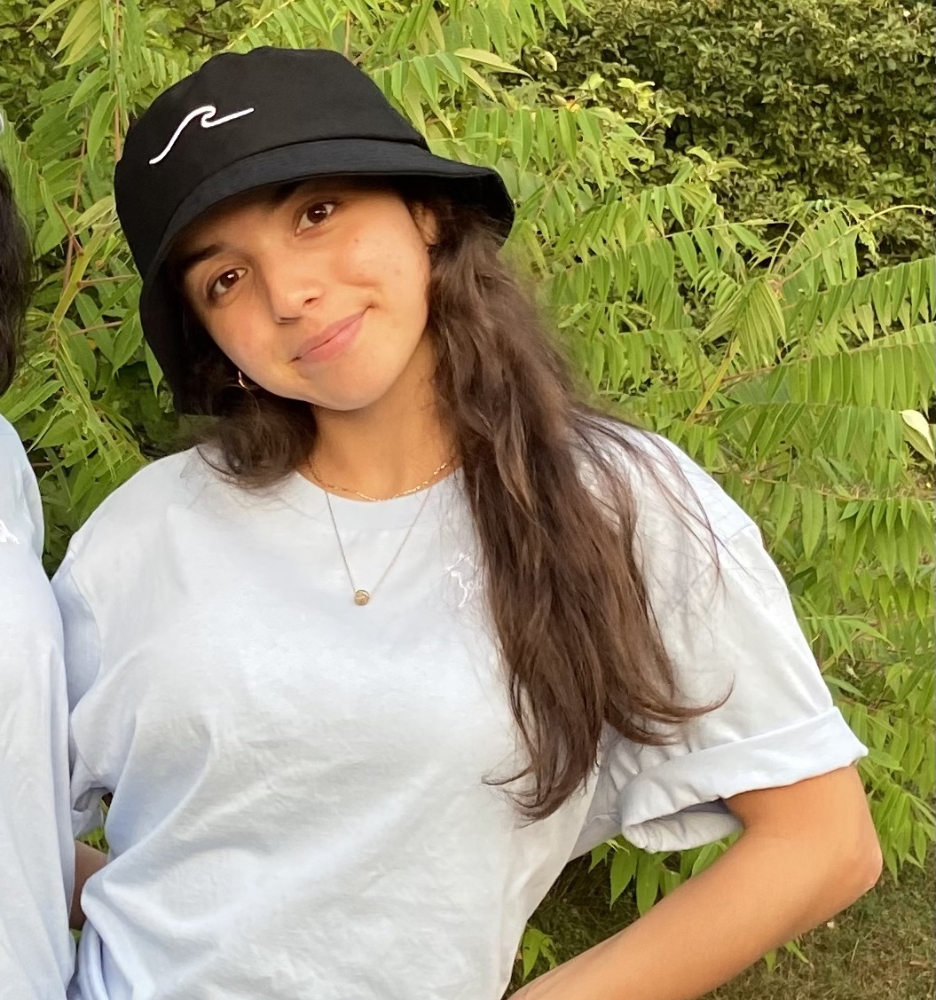
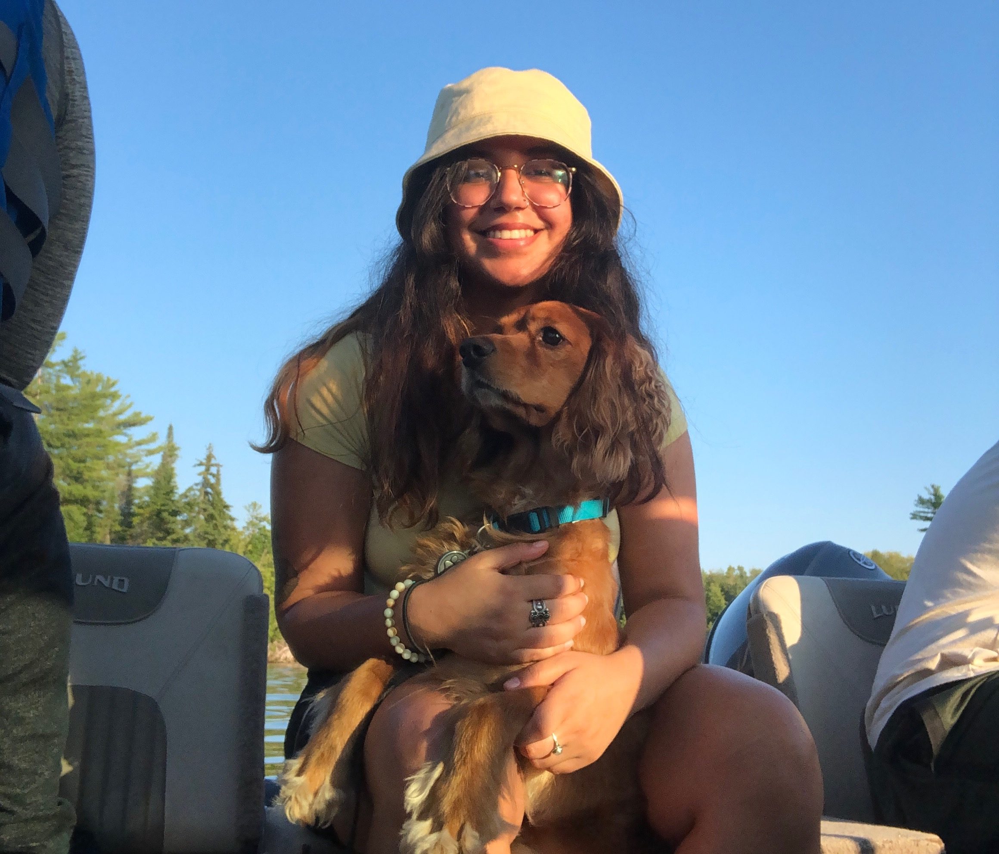
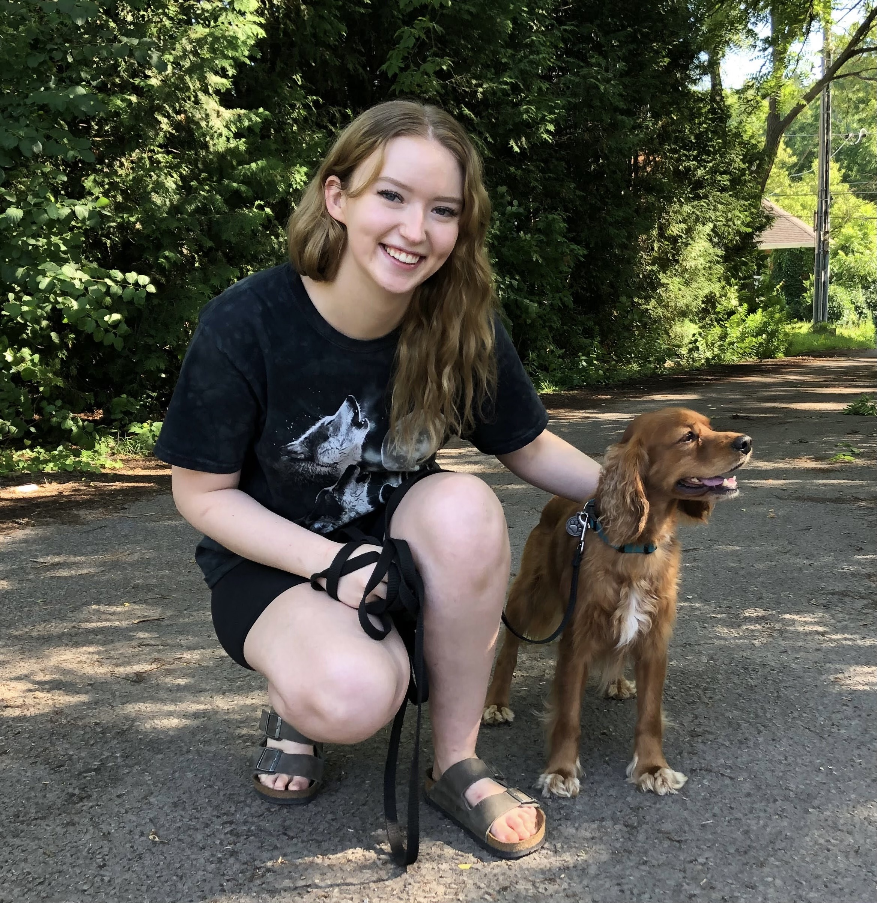

# Team McDisaster

## Team Member Bios

 **Madinakhon (Madina) Sulaymonova**: I am currently an ECCE Student Associate and in my fourth year of honours Environmental Sciences Co-op. I am on a track to attain a Certified GIS Professional (GISP) accreditation, by which I plan on carrying out my interest in GIS with my passion for epidemiology. Currently, I am working on a Senior Thesis that involves the use of ArcGIS Pro and ArcPy, to study the association between automobile emissions in terms of fine particulate matter and inhalation intake throughout various routes in Hamilton, Ontario. My hobbies include walking to Starbucks while listening to true crime podcasts and playing APEX Legends. 

 **Angelina Abi Daoud**: I am a first year Masters student at McMaster and a graduate diploma student with the United Nations University Institute for Water, Environment and Health. I also did my undergrad and a concurrent GIS Certificate at McMaster, where I did my thesis on the sedimentation and ichnology of Tūranganui-a-Kiwa Bay in New Zealand. My current research involves using drone imagery and measured sections to characterize the stratigraphy and facies architecture of the Dunvegan Aquifer in the Liard Basin, Northwest Territories to mitigate hydrocarbon contamination risk caused by nearby fracking developments. Outside of academics, I love taking care of my plant jungle, raising my two baby hamsters, crocheting, and hiking. 

 **Olivia Maddigan**: I am a fourth year Geography and Environmental Science Co-Op student with a passion for GIS. My senior thesis project focuses on respiratory health determinants in Hamilton, Ontario. Outside of school, I can be found reading obscure Wikipedia pages, drinking herbal tea, and playing with my two cats (Lucifer and Felix). 