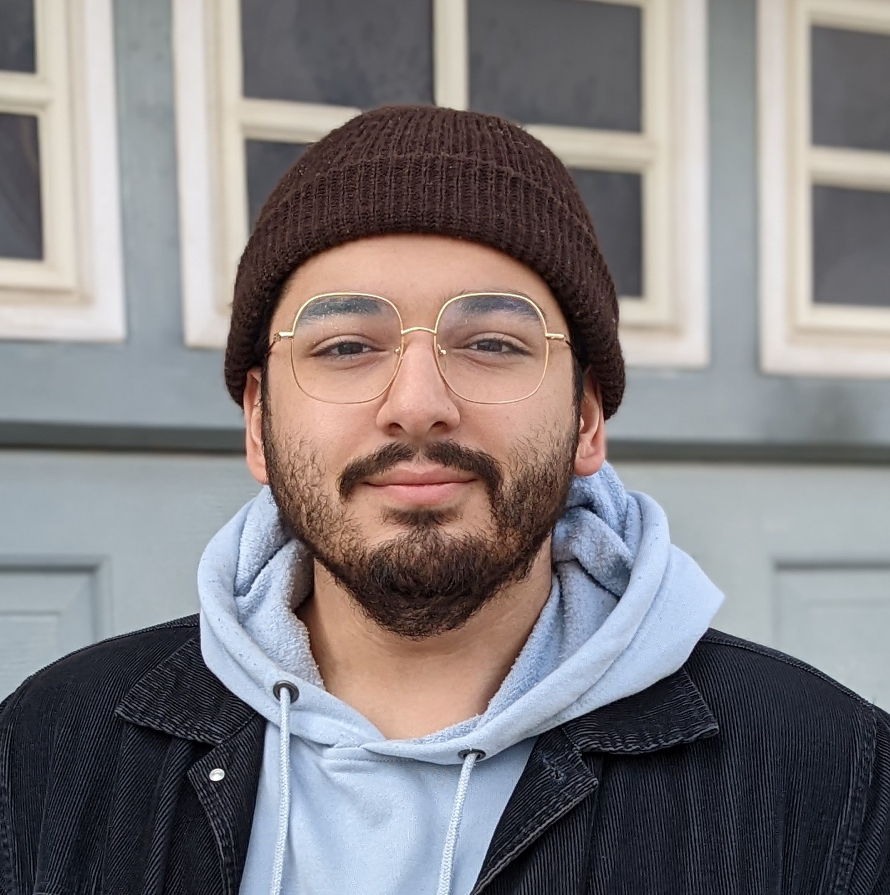
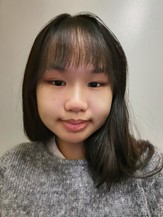
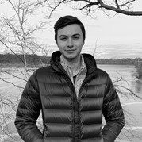

# Team McMappilicious

## Team Member Bios

 **Syed Hammad Uddin**: I am a fourth year Geography and Environmental Sciences student certificated in GIS and Urban Planning, graduating next month. I am interested in the municipal asset side of GIS and the role of spatial analysis in the future of our cities. My hobbies include spending my weekends watching F1, reading, and experimenting with food in the kitchen. 

 **Jenny Chau**: I’m a third year student in Integrated Science specializing in Earth and Environmental Sciences. I’m interested in the use of GIS and remote sensing for natural resource management and climate change mitigation. I enjoy reading, photography, and playing musical instruments. 

 **Jonathan Spence**: I am a fourth year student in Integrated Science, concentrating in Earth and Environmental Sciences, and minoring in GIS. I am interested in the geological and ecological side of GIS/remote sensing, and how it can be used to monitor and mitigate climate change. When not working I enjoy water polo, mountain biking and kayaking, as well as cooking. 
