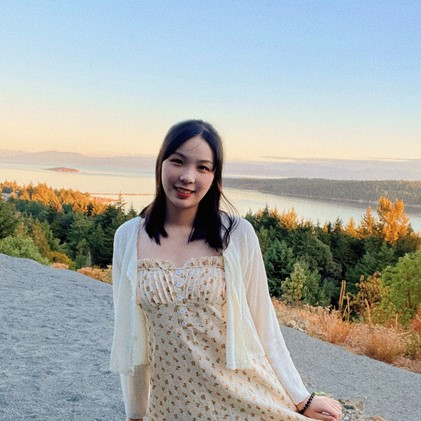
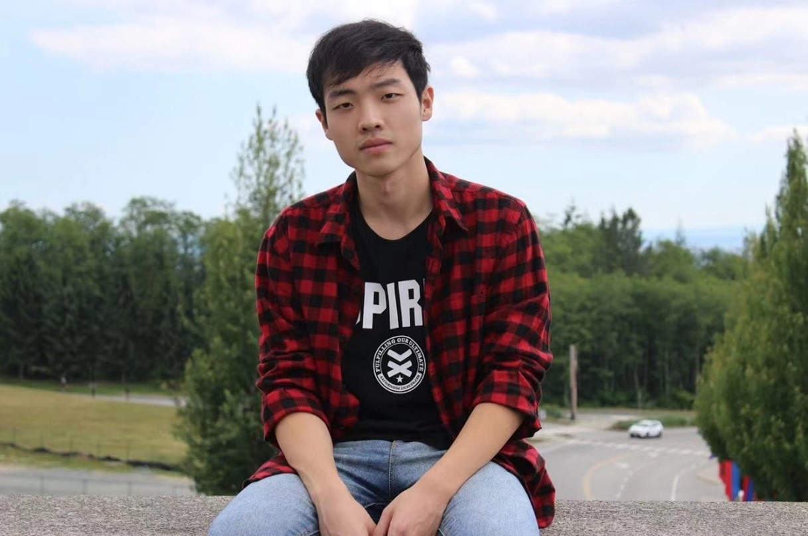
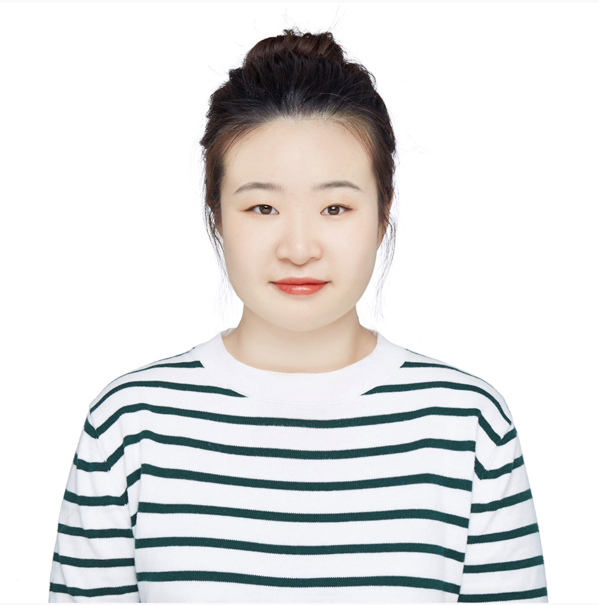

# Team Westerlies

## Team Member Bios

 **Xilin Wan**: Xilin is a fourth-year undergraduate student majoring in Global Environmental Systems with certificates in Geographic Information Science and Computing Studies at Simon Fraser University. She is looking forward to starting graduate studies this September and working with Geographic information systems in different fields. During her free time, Xilin enjoys hiking, painting and cooking. 

 **Lan Qing Zhao**: Lan Qing is a fourth year undergraduate student majoring in Physical Geography and Spatial Information Science. He also completed a certificate in GISience, and is expected to start his MSc in Spatial Modeling & Analysis in Fall. Outside of school, Lan Qing enjoys acting, filming, music and basketball. 

 **Lingxuan Fan**: Lingxuan is a fourth-year undergraduate student in geographic information science major. She is interested in GIS and human geography research. During her free time, she likes going to the gym and cooking. 
