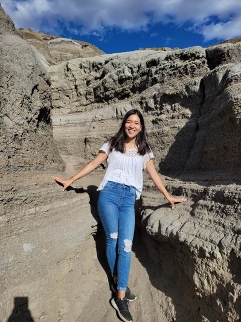
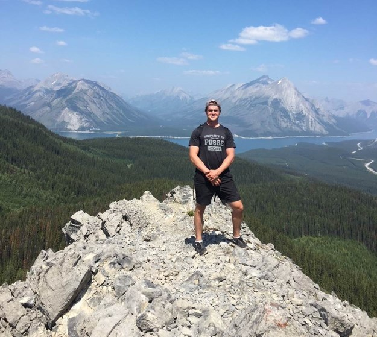
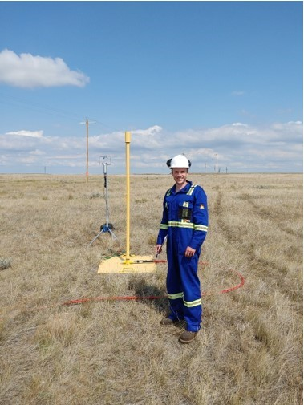

# The Geograsaurs

## Team Member Bios

 **Yui Tanagi**: I am a second year Masters of Geographic Information Systems (MGIS) student at the University of Calgary, focusing on the accessibility of sidewalks in different residential neighborhoods. As someone with roots in Japan, I have always been interested in learning about extreme weather events due to the number Japan faces every year. This has led me to pursue a bachelor’s degree in Physical Geography at the University of Calgary and now an MGIS degree. I plan to use GIS in the future to protect people by creating a more accessible and safer environment for everyone including people with disabilities especially during these extreme events. 

 **Chandler Billinghurst**: I am a first year MSc student at the University of Calgary (UofC) currently undertaking research on methane emissions sensing technologies. I have had the opportunity to be involved in a number of research projects since the start of my undergraduate degree concerning a range of topics from aeolian sediment transport on Mars to oil and gas infrastructure in urban and upstream settings. I've had the opportunity at the UofC to gain meaningful academic and professional experience in the field of oil and gas with an emphasis on movement towards sustainable practices. Tackling the issue of greenhouse gas emissions is a central focus in my current research, representing a key issue I personally feel strongly about. Outside of my academic life I enjoy being involved in minor hockey development and playing live music. 

 **Coleman Vollrath**: I am a second-year Master of Science (MSc) student in the Department of Geography at the University of Calgary. My research evaluates new technologies, policies, and work practices to mitigate methane (CH4) emissions from the oil and gas (O&G) industry. A large portion of my research involves modelling the efficacy of various Leak Detection and Repair (LDAR) programs that O&G companies are required to implement as part of regulations in different jurisdictions in North America. This is research I am passionate about because I know the work I have the privilege of doing everyday contributes to reducing potent CH4 emissions and fighting climate change. This year marks my second time competing in the ESRI Canada Centres of Excellence (ECCE) App Challenge. In the last two years I've been developing my coding skills in Python, but I'm looking forward to taking this week as an opportunity to explore the ArcGIS API for JavaScript to develop a web application. When I'm not working on mitigating CH4 emissions I'm either hiking in the mountains with my wife and dog or spending time in a hockey rink coaching and mentoring younger players! 
