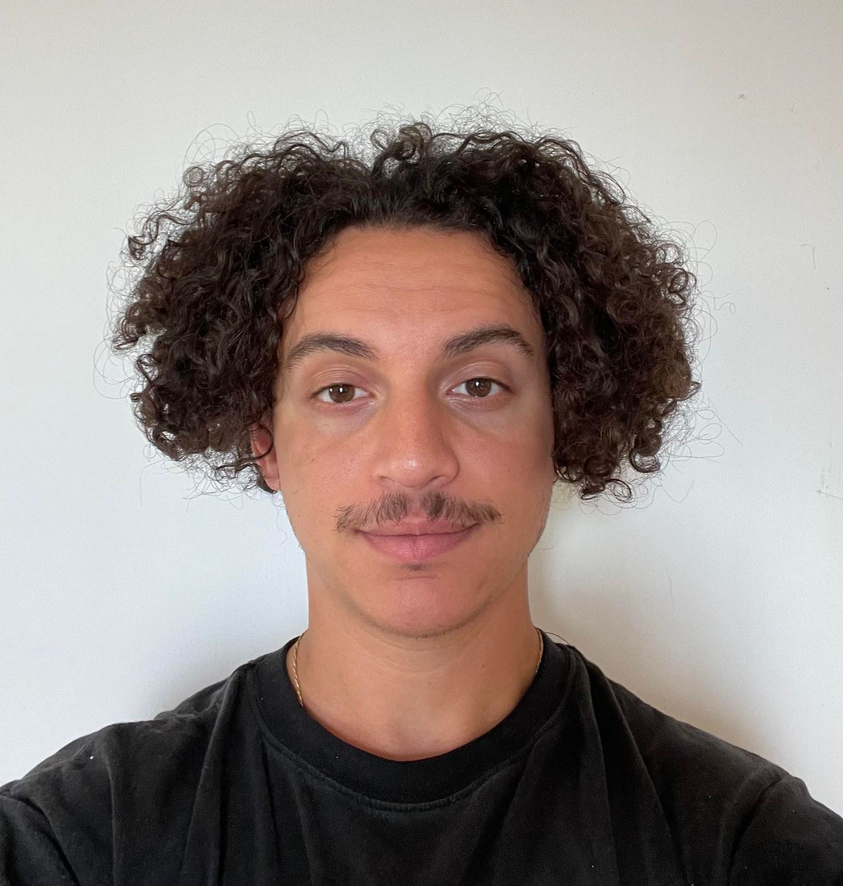
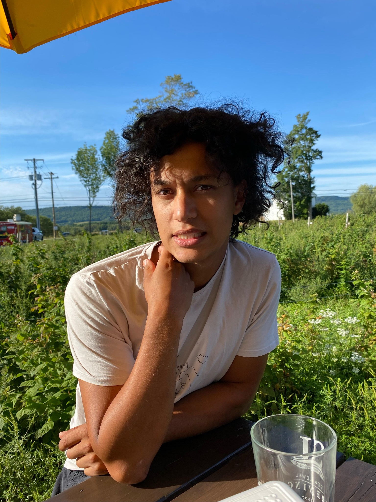
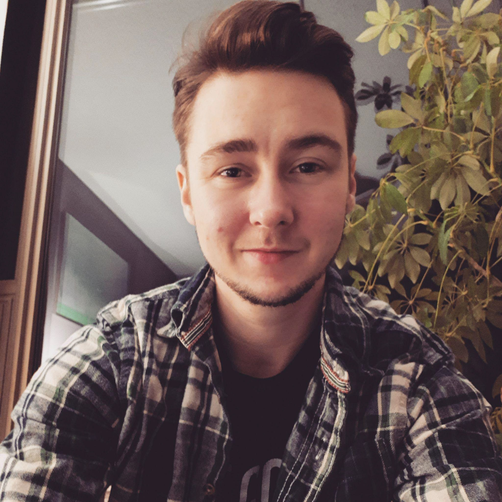

# The_Underscores

## Team Member Bios

 **Cyril Massoud**: I am a current student at the Centre of Geographic Sciences (COGS) – NSCC, in the Geographic Information Systems graduate certificate program, and I am expected to graduate by the end of May, 2022. Having first completed a B.A in environmental studies and philosophy at Concordia University, I’ve developed a passion for climate change adaptation and sustainability. I focused my research on the intersections of environmental science, economic growth, and urbanization, in the wake of an alarming climate crisis.  During my undergrad, I was also introduced to geographic information systems (GIS) and quickly developed a strong appreciation for its power to perform spatial analyses. I became particularly interested in its use as a tool to better understand the extent of the human impact on earth's geography, ecosystems, and changing climate. In my current studies at COGS, I am strengthening my technical skills and knowledge of GIS software, including how to efficiently manage and analyze spatial datasets through Python programming, geoprocessing in ArcGIS Pro, and SQL database management. I am also acquiring skills in data visualization through web programming with JavaScript and app development in ArcGIS Online. 

 **Tomas Milla-Koch**: I am currently a graduate certificate Remote Sensing student at the Centre of Geographic Sciences (COGS).I have a Bachelor's of Science (BSc.) from McGill University in Earth System Science where I found interests in the fields of Geodynamics, Volcanology, Glaciology, Climatology, Programming, Mathematical Modeling, and more. Throughout my time during my undergraduate degree, I was part of the Geodynamics research group in the Earth and Planetary Sciences department where I conducted research from topics such as sediment compaction and its contribution to local and global sea level change, and sensitivity analyses of sea level model outputs to ice history. Outside of school I enjoy playing music, woodworking and trying to skateboard. 

 **Andrew Dupuis**: I am currently a student at NSCC's Centre of Geographic Sciences, in the Remote Sensing graduate certificate program. I completed a Bachelor of Science degree at Saint Mary's University with a Major and Honors in Biology. As someone who enjoys math, data, and anything analytical, and is also passionate about environmental sustainability, my primary area of interest became population genetics. I volunteered in a genetics lab focused on marine mammal conservation through DNA analysis, and through the same lab conducted my Honurs research mapping the movement patterns of the Sable Island horses using RStudio.  After graduation, I spent a couple of years working in Customer Success at a tech startup in Halifax learning about scientific content creation and user experience. Through this company I was able to pursue an interest in software development and quality assurance, and transitioned to a Software QA role developing automated testing suites, managing SQL queries, and doing some back-end development in Python. Attending COGS has allowed me to combine my interest in data analytics and programming with skills that can be applied to a variety of areas in conservation and resource management, among others. When I'm not working I enjoy hiking, bouldering, and playing the piano. 
