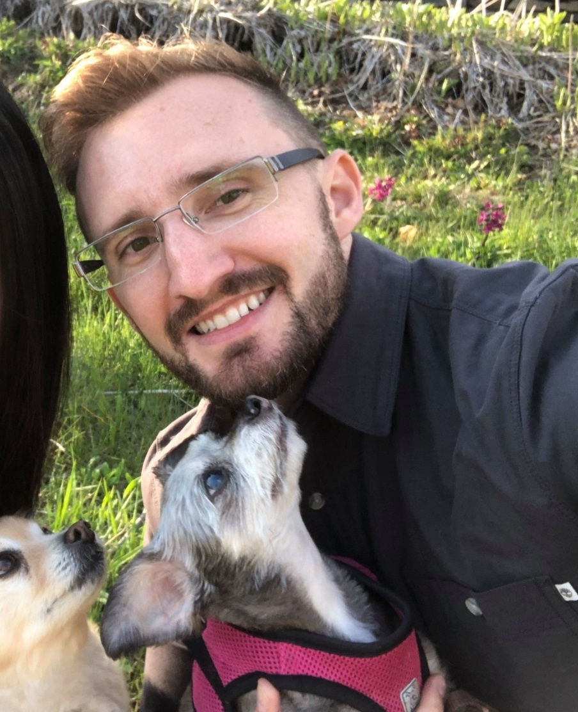

# Tobler's Acolytes

## Team Member Bios

 **Leah Fulton**: Leah is a Master of Marine Management student at Dalhousie University in Halifax, Nova Scotia. Her research involves understanding the application of side scan sonar to detect abandoned, lost, or otherwise discarded fishing gear in benthic environments. During her undergraduate degree in urban planning and design, she gained a strong interest in landscape-level planning, structural connectivity, and conservation GIS. Combining both interests, her current work includes various projects with organizations such as Coastal Action, Dalhousie University, Parks Canada, and Ontario Parks. This is Leah’s third app challenge! Outside of school, she can be found trail running, walking her dog Echo, searching for the tastiest stout, or cooking up a storm. 

 **Beau Ahrens**: Beau is a PhD Candidate in the Interdisciplinary PhD program at Dalhousie University in Halifax Nova Scotia, under Dr. Daniel Rainham. After completing his BA and MSc at the University of Guelph in Geography, focusing on GIS and Spatial Analysis techniques and theory. He now works on various projects studying the relationships between a person’s environment and their health and wellbeing. In his PhD research, Beau seeks to leverage spatial analysis and remote sensing techniques to understand the optimal tree and greenspace characteristics in promote good health in our cities. Beau has more recently moved to Calgary, to find new outdoor adventures for himself and his two dogs (Pixie and Kobe). 
