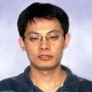
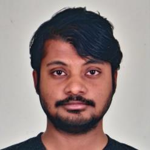
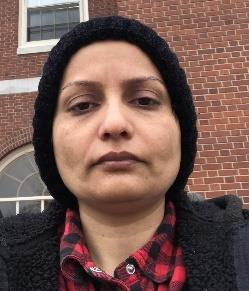

# UNB Beaver

## Team Member Bios

 **William Liu**: William is a software developer and part-time MSc student in remote sensing and GIS field. He works for the Advanced Geomatics Image Processing Lab at University of New Brunswick and has participated various research and software development projects in image processing, computer vision, remote sensing, and GIS. 

 **Avinaba Mistry**: Avinaba is a computer science graduate student at the University of New Brunswick, Fredericton. He is pursuing completion of his thesis centered around geo-spatial considerations of contagion spread under the supervision of Dr. Suprio Ray. Before resuming his academic career after completing his undergraduate degree, he acquired 5 years of professional UX design experience in startups. He aspires to utilize his distinct background to bring fresh perspectives to solve complex problems. 

 **Sima Peyghambari**: Sima received a PhD degree in Geology (Petrology) from Shahid Bahonar University of Kerman (Iran). She was an assistant professor in the Geology department of Payame-Noor University of Tehran (Iran). She is PhD student in Engineering under supervising Dr. Zhang at the University of New Brunswick. She has authored or coauthored over 10 research papers. 
