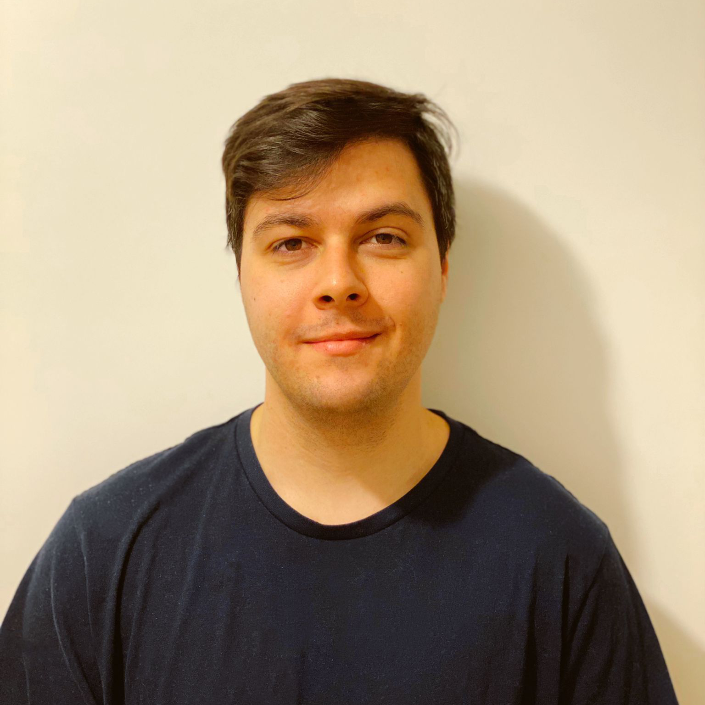

# Water We Doing

## Team Member Bios

 **Danilo Jovanovic**: I am a fourth-year undergraduate student competing in this challenge for the first time. I am majoring in physical geography, with minors in biology and sociology. GIS and remote-sensing courses have been my favourites during my studies, so I am excited to learn more and develop my skills in this challenge! In my spare time, I dabble in graphic design, writing, and literature. I also spend hours poring over old and new maps, discovering what has been discovered before. I hope to one day contribute some of my own knowledge to future cartophiles. 

 **Gabriella Sta. Cruz**: I am a fourth-year undergraduate student double-majoring in GIS and Human Geography. Throughout university, I have thoroughly developed my love for GIS and learning about the relationships between place and space. After my undergrad, I aspire to obtain a Masters in Urban Planning and one day become a professional planner. 

 **Ryan Wong**: I enjoy making music, and creating useful mobile apps. My passion for teaching and computers has led me to love GIS because of the opportunity to transform data and delight viewers by weaving meaningful stories. I am in my 4th year at University of Toronto Mississauga studying GIS, Communication Technology, and Computer Science. 