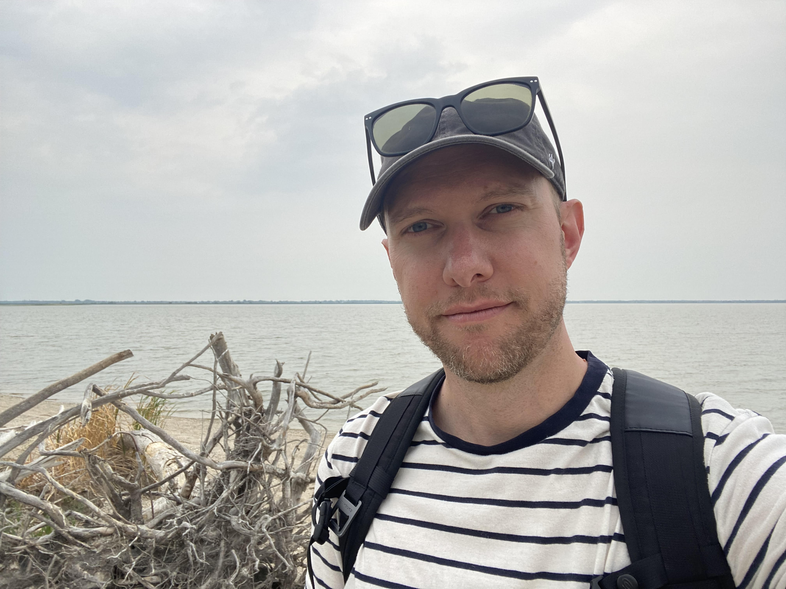

# emerGIScy COORDINATE-ors

## Team Member Bios

 **Ben Schager**: Ben is a student in the Advanced Diploma program at BCIT. As a former neuroscientist who didn't have the brains for science, GIS provided an avenue for Ben to pursue a lingering interest in generating, analyzing, and presenting data while working in an industry where one doesn’t often need to go the lab at 2 in the morning. Ben graduated with a BASC from Quest University Canada and a MSc from the University of Victoria, both studying neuroscience. Naturally, given his educational background, Ben has worked extensively in forestry. It was there that he discovered and fell in love with GIS and the problems that it was created to solve. If you want to see Ben when he isn’t tinkering with some script, studying, or reading a book, you will have to ask him to go for a bike ride. Fair warning: He will probably try to persuade you to go for a beer afterward! 

 **Matt Meeboer**: Matt is a current BCIT GIS Advanced Diploma student. After completing a diploma in Computer Systems Technology from the Northern Alberta Institute of Technology, he worked in several industries as a business systems analyst where he was exposed to GIS and gained an appreciation for the many problems it can solve. In 2021, Matt decided to pivot his career into GIS, and has been focused on spatial analysis and GIS-focused application development, specifically for urban use cases. In his free time, he enjoys biking, playing music with friends, and strategy games. 

 **Evangeline (Evie) Lapalme**: Evie graduated from Simon Fraser University in 2021 with a B.A. in Geography, a minor in Archaeology, and with a Certificate in Geographic Information Systems (GIS). She is currently completing the Advanced Diploma Program in GIS at BCIT concurrent with the ESRI App Challenge to further her hands-on experience with application design, programming, and cartography. Evie's hobbies include photography, crafting, and tea. 
